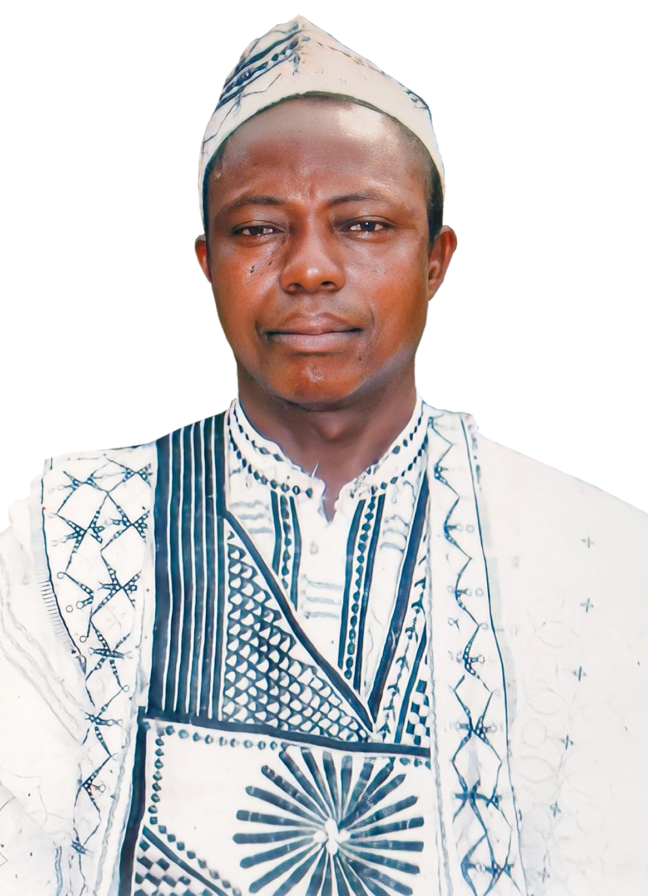
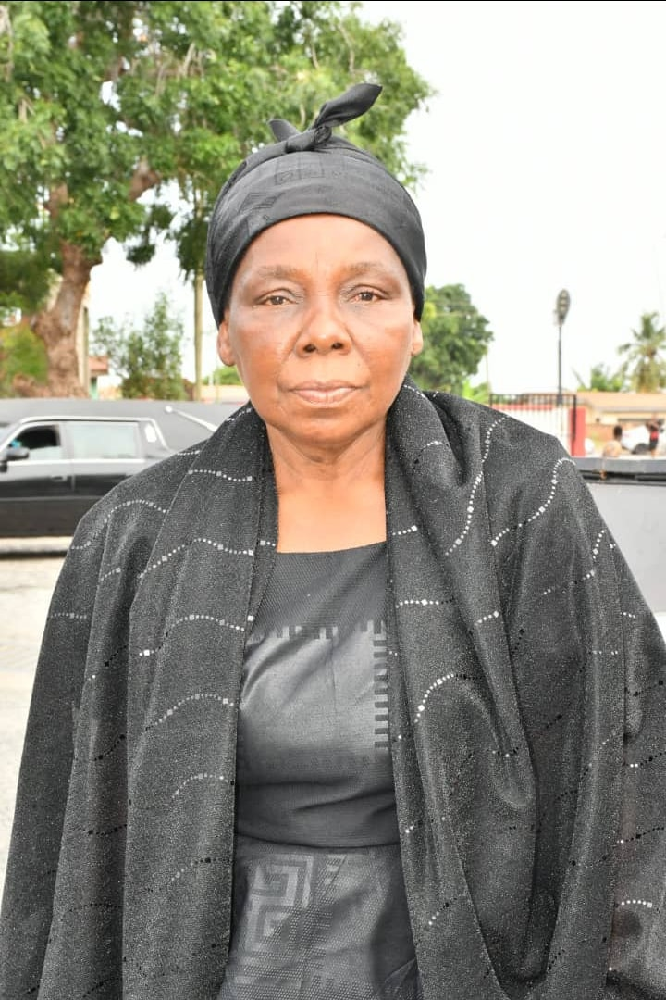
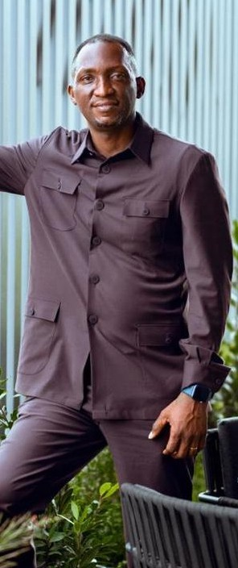
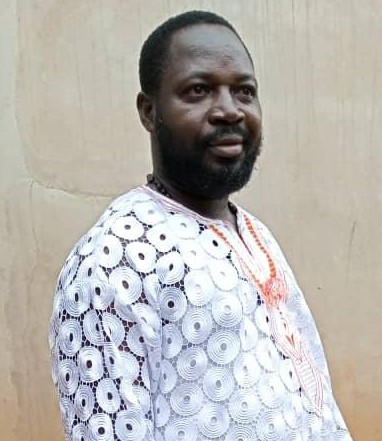

# SamuelYaoAdeklo
Samuel Yao Adeklo Memorial -In Loving Memory 

# 🌿 In Loving Memory of Samuel Yao Adeklo

  

---

## 🕊️ Overview

This project is a beautifully designed **In Loving Memory & Biography Website** dedicated to **Samuel Yao Adeklo (1954–2023)**.

It is more than a website — it is a **digital legacy**, preserving his life story, impact, and memories for generations to come.

---

## 🌐 Live Website

https://samueladeklo.created.app/

---

## 💻 GitHub Repository

https://github.com/solomonyaw/-SamuelYaoAdeklo

---

## 📣 Project Story (Facebook Post)

🌿 **In Loving Memory of My Dad – A Digital Legacy** 🌿  

I’m honored to share a very personal project I’ve been working on — a beautifully designed **“In Loving Memory & Biography Website”** dedicated to my late father, **Samuel Yao Adeklo**.  

This wasn’t just a web project for me… it was a journey of remembrance, reflection, and storytelling. I wanted to go beyond the traditional way of preserving memories and instead create a **digital experience that tells his life story in a meaningful, visual, and timeless way**.  

Through this website, I’ve captured:  
✨ His life story and biography  
✨ The love he shared with family and friends  
✨ Tributes that reflect his impact  
✨ A legacy that will live on for generations  

As a developer and storyteller, I designed the site to feel **emotional, interactive, and alive** — not just a page, but a space where memories can be felt.  

This project means a lot to me because it’s not just about code… it’s about **honoring a father, a mentor, and a great man whose influence shaped my life**.  

🌐 **Live Website:**  
https://samueladeklo.created.app/  

💻 **GitHub Repository:**  
https://github.com/solomonyaw/-SamuelYaoAdeklo  

I believe technology can do more than solve problems — it can **preserve legacies and tell stories that matter**.  

🕊️ Rest in peace, Dad. Your legacy lives on.  

---

## ✨ Features

- 📖 Biography (Original text preserved)
- 💬 Tributes from family
- 🖼️ Photo gallery
- 🎨 AI-generated storytelling visuals
- 🕯️ Interactive memorial experience
- 🎵 Hymns and reflections

---

## 🖼️ Below are the family of Samuel Yaw Adeklo

### 🏠 Wife (Elizabeth Adeklo)

  

### 📖 Son (Michael Gibson Kumah)

  

### 💬 Son (Solomon Yaw Adeklo)

  

### 🖼️ Son (Patrick Adeklo)

  

---
<!DOCTYPE html>
<html lang="en">
<head>
  <meta charset="UTF-8">
  <title>Memorial App - Samuel Yao Adeklo</title>
</head>
<body style="font-family: Arial, sans-serif; line-height: 1.6; background-color: #f9f9f9; color: #333; padding: 20px;">

  

    <h1 style="text-align: center;">📱🌿 Memorial App Now Available – Honoring My Dad’s Legacy 🌿</h1>

    

      I’m grateful to share another step in preserving the legacy of my late father, 
      <strong>Samuel Yao Adeklo</strong>. The <strong>mobile app (Android/APK version)</strong> 
      of his <em>In Loving Memory &amp; Biography Website</em> is now available.
    

    

      This app was created to make it easier for family, friends, and loved ones to 
      <strong>access his life story, tributes, memories, and legacy anytime, anywhere</strong>. 
      It’s more than just an app — it’s a digital space where his memory continues to live on.
    

    

      <h2>📲 Download the App (APK)</h2>
      <a href="https://www.upload-apk.com/en/jwCNAMD5cEhnvL8" target="_blank" 
         style="display: inline-block; padding: 12px 25px; background-color: #2c7be5; color: #fff; text-decoration: none; border-radius: 5px; font-weight: bold;">
         Download Now
      </a>
    

    

      🕊️ Keeping the legacy alive through technology
    

  

</body>
</html>

## 🧑‍💻 Author

**Solomon Yaw Adeklo**  
Software Developer | AI Enthusiast | Storyteller  

---

## 🕊️ Final Words

> “Technology can preserve legacies and tell stories that matter.”

Rest in peace, Dad. Your memory lives on forever.

